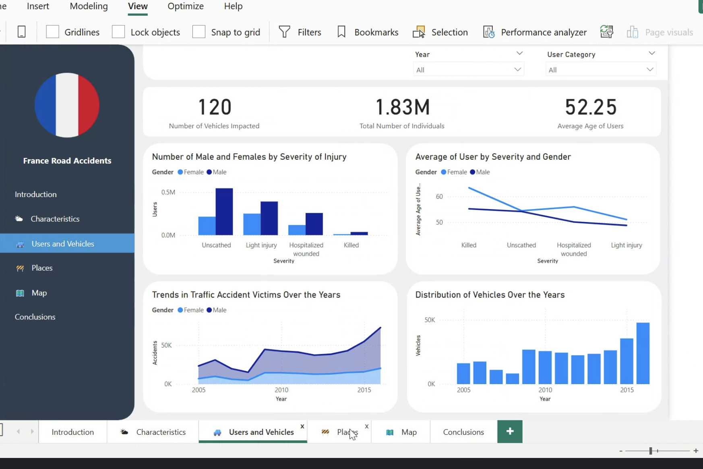

# 🚦 Road Accident Analysis in France – Data Warehouse & Power BI Project

This project demonstrates a full end-to-end data pipeline: from unstructured data exploration to a business-ready Power BI dashboard. It involves data modeling in 3NF, building an ELT pipeline using SQL and Python, and visualizing findings via Power BI. The final goal: to help stakeholders make informed, data-driven decisions about road safety in France.

---

## 📌 Project Roadmap

### ✅ Step 1: Data Exploration
- **Goal**: Define the project context and analyze the structure of unstructured raw data.
- **Deliverable**: A report describing data sources and showing examples of raw data.

---

### ✅ Step 2: Data Modeling
- **Goal**: Design a database in **Third Normal Form (3NF)** using the **Snowflake Schema**.
- **Actions**:
  - Created a UML diagram showing relationships between tables: Characteristics, Places, Users, and Vehicles.
  - Ensured high data integrity and normalization.
- **Deliverables**:
  - UML diagram
  - SQL schema creation script

---

### ✅ Step 3: ELT Pipeline & Star Schema
- **Goal**: Build an ETL/ELT pipeline to load and transform the data for analytics.
- **Actions**:
  - **Extraction**: Loaded raw data from original sources.
  - **Transformation**: Performed merging, encoding, and quality checks using Python.
  - **Loading**: Denormalized into a **Star Schema** and loaded into a Snowflake Data Warehouse.
- **Deliverables**:
  - SQL transformation scripts
  - Star schema design

---

### ✅ Step 4: Power BI Dashboard
- **Goal**: Visualize accident patterns and share actionable insights.
- **Actions**:
  - Built interactive dashboard with filters and KPIs
  - Presented project findings in an easy-to-understand format for stakeholders
- **Deliverables**:
  - Power BI `.pbix` file
  - Dashboard screenshots

---
## 📊 Dashboard Preview

Here’s a preview of the Power BI dashboard built in this project:

## 🔍 Key Insights

- 🚗 **2016** had the **highest number of accidents** on record.
- 📉 **2008** showed a **notable drop** in accidents.
- 📅 **Fridays** had the **most frequent** accidents.
- 👨‍🦰 **Males** were involved in **more accidents** than females.
- 👵 **Older passengers** had a **higher risk** in accidents.
- 🛣️ **Communal road types** saw the most accident occurrences.

---

## 🧠 Project Conclusions

- ✅ Applying 3NF and Star Schema design ensured structured and efficient data analysis.
- 🧼 The transformation phase improved data quality for downstream analytics.
- 📊 The dashboard empowered stakeholders to explore accident patterns.
- 🧭 Results can inform **policy-making** and transport safety strategies in France.

---

## 🧰 Tech Stack

- **Data Warehouse**: Snowflake
- **Database Design**: UML, 3NF, Star Schema
- **SQL**: Schema creation, transformation queries
- **Python**: Data cleaning & transformation
- **Power BI**: Dashboarding & data storytelling

---

